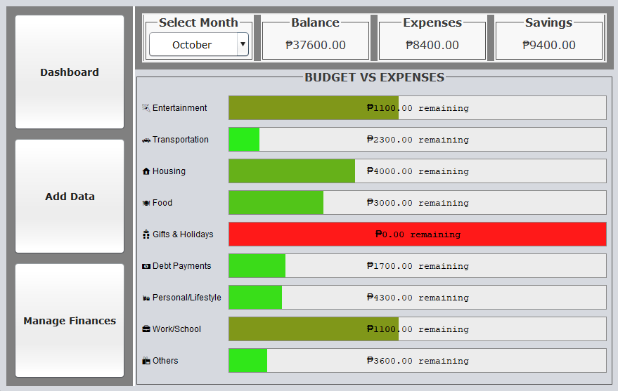
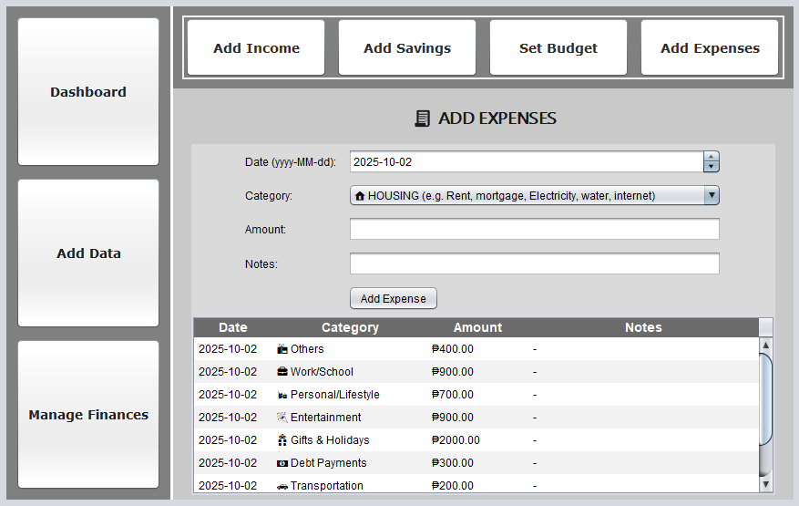
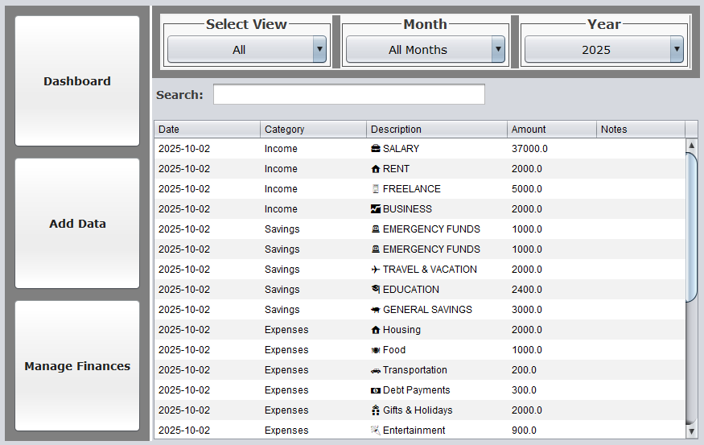

# 💰 MoneyCure – Personal Finance & Expense Tracker

MoneyCure is a simple yet powerful **money tracking application** built with **Java Swing**.  

It helps users manage their **income, expenses, and savings** in one place, with an easy-to-use interface and filtering options.

---

## ✨ Features

- 📊 **Dashboard Overview**  
  View a quick summary of your financial health.

- 💵 **Add Income, Savings, Budget & Expenses**  
  Add, edit, and delete transactions with categories, descriptions, and notes.

- 🔎 **Smart Filtering**
    - Filter by **Month** and **Year**
    - Filter by **Category** (Income, Expense, All)
    - Search transactions in **real-time**

- 💾 **Persistence**  
  Transactions are managed via DAO classes, making it easy to switch to database or file storage.

---

## 🛠️ Tech Stack

- **Language**: Java (JDK 17)
- **IDE[.gitignore](.gitignore)**: IntelliJ IDEA
- **GUI**: Swing
- **SQLITE**
---

## 🎥 Screenshots
*DASHBOARD*

*ADD DATA*

*MANAGE FINANCES*

## 👤 Author
- **Kathlene Manaloto**
- [GitHub](https://github.com/KathManaloto)
- [LinkedIn](https://www.linkedin.com/in/kathlene-manaloto/) 